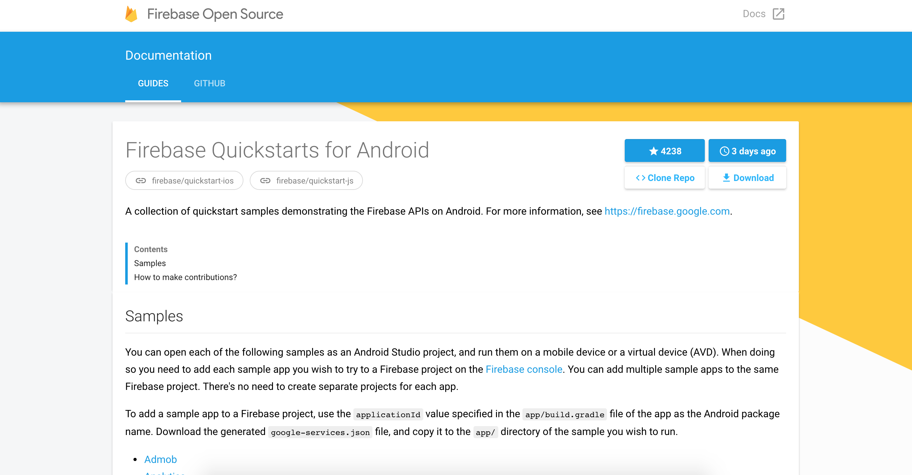

# firebaseopensource.com

A directory of Firebase open source projects and their documentation.

Projects listed on firebaseopensource.com (abbrev. fosdc) automatically get beautiful
auto-generated landing pages:

Example: https://firebaseopensource.com/projects/firebase/quickstart-android/

Want to learn how to get your repo set up? Check out the
[guide](docs/configure-repo.md).

## Contributing

We love contributions! See [CONTRIBUTING.md](./CONTRIBUTING.md) for guidelines.